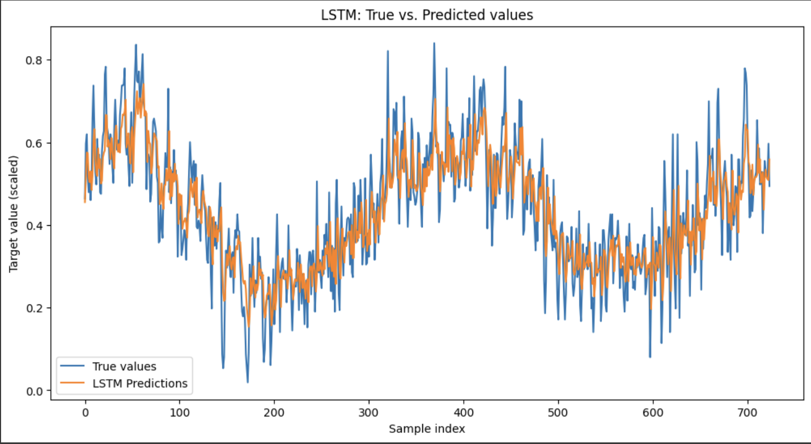
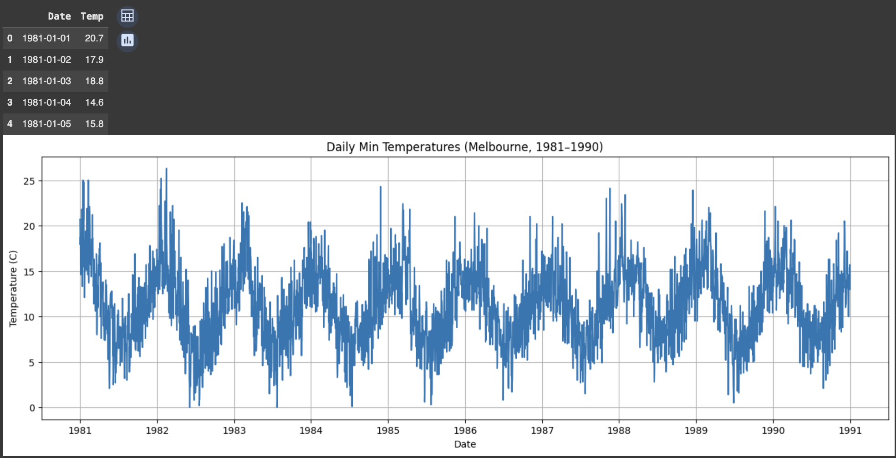
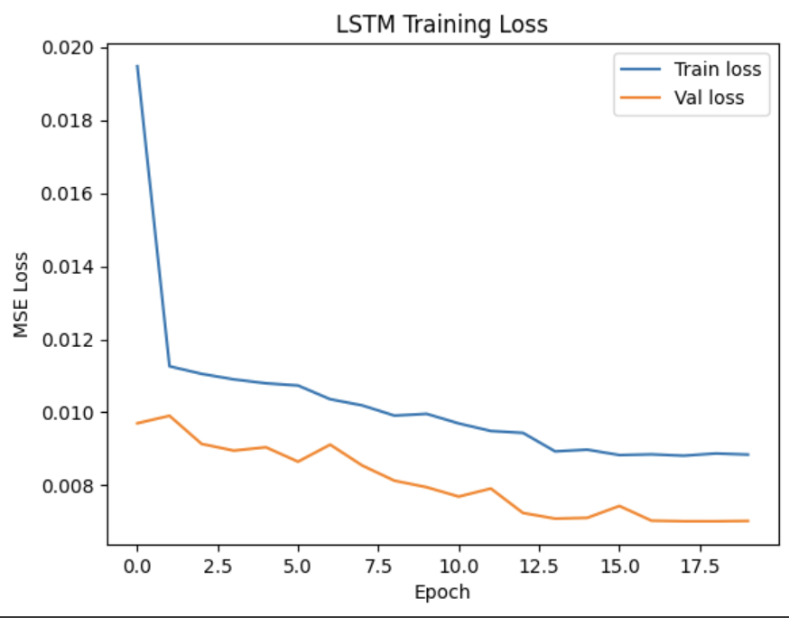

# LSTM Time Series Forecasting

This project demonstrates the use of LSTM (Long Short-Term Memory) neural networks for time series forecasting using real tabular data.  
The workflow includes data visualization, preprocessing, model training, evaluation, and insightful visual comparisons of predicted and true values.

---

## Project Overview

- **Goal:** Forecast future values of a univariate time series using LSTM neural networks.
- **Data:** Daily minimum temperatures in Melbourne, Australia, 1981–1990.
- **Tech stack:** Python, Keras, TensorFlow, matplotlib, pandas, scikit-learn.

---

## Workflow

1. **Dataset Exploration and Visualization**
    - View and visualize the input time series.

    

2. **LSTM Model Training**
    - Sequence preprocessing, scaling, splitting to train/test.
    - Model architecture: single LSTM layer + Dense output.
    - Visualization of training and validation loss.

    

3. **Evaluation and Prediction**
    - Comparison of LSTM predictions with actual values on the test set.

    

---

## Results

- **Train and validation loss** decrease steadily, showing good model fit.
- **LSTM predictions** closely follow the true values, demonstrating strong forecasting capability for time series data.

---

## Requirements

- Python 3.8+
- TensorFlow >= 2.0
- Keras
- matplotlib
- pandas
- scikit-learn

---

## References

- [TensorFlow LSTM Documentation](https://www.tensorflow.org/api_docs/python/tf/keras/layers/LSTM)
- [Keras: Time Series Forecasting](https://keras.io/examples/timeseries/timeseries_weather_forecasting/)

---

**Project by: Nikita MArshchonok**

